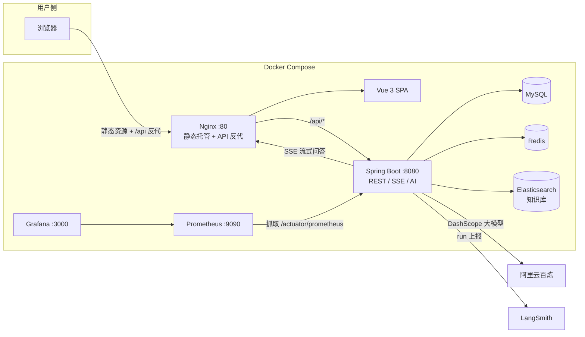

# 宇宙是旷野

宇宙是旷野是一个中英双语的天文科普网站。围绕恒星、行星、卫星、星系、星云、彗星、小行星等天体分类展开，提供双语首页、分类页、天体详情、AI 讲解（RAG 知识库问答）、联网检索、站内搜索与本地收藏。所有 AI 回答固定为中文。

## 技术栈

- 前端：Vue 3 + Vite + vue-router + vue-i18n（中英双语，localStorage 记忆语言）
- 后端：Spring Boot 3（Java 17）+ Spring Data JPA + Redis + Elasticsearch + langchain4j
- AI：阿里云百炼（DashScope qwen-plus / text-embedding-v3）混合检索 RAG + 联网检索
- 可观测：LangSmith 追踪（可选）+ Micrometer Prometheus + Grafana
- 部署：Docker + Docker Compose + Nginx

## 目录

- `frontend/`：Vue 3 前端（含搜索页、收藏页）
- `backend/`：Spring Boot 3 后端（含 RAG 问答、LangSmith 追踪客户端）
- `docs/`：开发文档、7 天计划与上线部署手册（`docs/deploy-online.md`）
- `monitoring/`：Prometheus 抓取配置
- `docker-compose.yml`：本地开发编排（MySQL / Redis / Elasticsearch / 后端 / 前端 / Prometheus / Grafana）
- `docker-compose.prod.yml` + `docker-compose.https.yml`：生产编排（只暴露 Nginx，内网互连 + 可选 HTTPS 叠加层）
- `deploy/`：生产环境变量模板、HTTPS 站点配置与证书目录
- `scripts/`：服务器初始化 / 整站备份 / 恢复脚本

## 架构



关键链路：浏览器 → Nginx（`proxy_buffering off` 保证 SSE 逐字输出）→ Spring Boot → 混合检索（ES 关键词 + 向量）→ 组装资料 → DashScope 生成 → 流式返回。

## 启动方式

### 方式一：本地开发

前端：

```bash
cd frontend
npm install
npm run dev
```

后端（需先启动 MySQL:3307、Redis:6379、Elasticsearch:9200）：

```bash
cd backend
./mvnw spring-boot:run
```

Windows 下可使用 `mvnw.cmd`。无 `DASHSCOPE_API_KEY` 时应用照常启动，仅 `/api/ai/*` 问答接口 404。

### 方式二：Docker 一键部署（推荐）

```bash
# 1. 复制环境变量模板并填入真实 key（DASHSCOPE_API_KEY 是唯一必填）
cp .env.example .env

# 2. 构建并启动全部服务
docker compose up -d --build

# 3. 访问
#    网站        http://<服务器IP>
#    Prometheus  http://<服务器IP>:9090
#    Grafana     http://<服务器IP>:3000  (admin/admin)
#    后端 API    http://<服务器IP>:8080/api
```

说明：

- 机器建议最低 4G 内存（Elasticsearch 单独占 512m）。
- **必须保留 Nginx 的 `proxy_buffering off`**，否则 `/ask` 的 SSE 流式问答会被缓冲，前端收不到逐字输出。
- 无任何 key 也能全栈启动：AI 问答 404，其余功能正常。
- 健康检查：`curl http://localhost:8080/api/health` 应返回 `{"success":true,"data":{"status":"UP"...}}`。

### 方式三：生产上线（大陆服务器 + 域名，正式运营）

> ⚠️ 生产**不要**用方式二的 `docker compose up`（那是本地编排，会把 MySQL/ES 等全暴露公网）。
> 完整步骤（买服务器/域名、备案时序、HTTPS、备份运维、排查表）见 **[docs/deploy-online.md](docs/deploy-online.md)**。

```bash
# 服务器上（Ubuntu/Debian，root）：
curl -fsSL https://raw.githubusercontent.com/qilixiang007/wilderness/main/scripts/init-server.sh | bash

cd ~/wilderness
nano .env                          # 填 MYSQL_ROOT_PASSWORD / MYSQL_PASSWORD / DASHSCOPE_API_KEY / SMTP_*
docker compose -f docker-compose.prod.yml up -d --build

# 备案通过 + 证书就绪后开 HTTPS（见 deploy/certs/README.md 放证书）：
docker compose -f docker-compose.prod.yml -f docker-compose.https.yml up -d

# 日常备份（配 cron 见手册 §5.3）
bash scripts/backup.sh
```

生产编排要点：只映射 `80`（HTTPS 后加 `443`）；MySQL/Redis/ES/后端仅在 compose 内网互连；Prometheus/Grafana 只绑 `127.0.0.1`；关键凭据走 `.env`（`deploy/env.prod.example` 为模板，`.env` 已 gitignore）；ES 已开快照备份目录供 `scripts/backup.sh` 使用。

## 环境变量

本地开发见 [.env.example](.env.example)；生产部署见 [deploy/env.prod.example](deploy/env.prod.example)。`DASHSCOPE_API_KEY` 必填；`LANGSMITH_API_KEY` 可选（不填则 LangSmith 追踪静默降级）。

## 接口速览

| 方法 | 路径 | 说明 |
| --- | --- | --- |
| GET | `/api/categories` | 分类列表 |
| GET | `/api/categories/{slug}` | 分类详情（含天体） |
| GET | `/api/objects` | 天体列表 |
| GET | `/api/objects/{slug}` | 天体详情 |
| GET | `/api/search?q=` | 站内搜索 |
| GET | `/api/health` | 健康检查 |
| POST | `/api/ai/chat` | RAG 问答 |
| GET | `/api/ai/chat/stream` | SSE 流式问答 |
| GET | `/api/ai/explain/{slug}` | 单天体 AI 科普讲解 |
| POST | `/api/knowledge/upload` | 上传文档入库（txt/pdf/md） |
